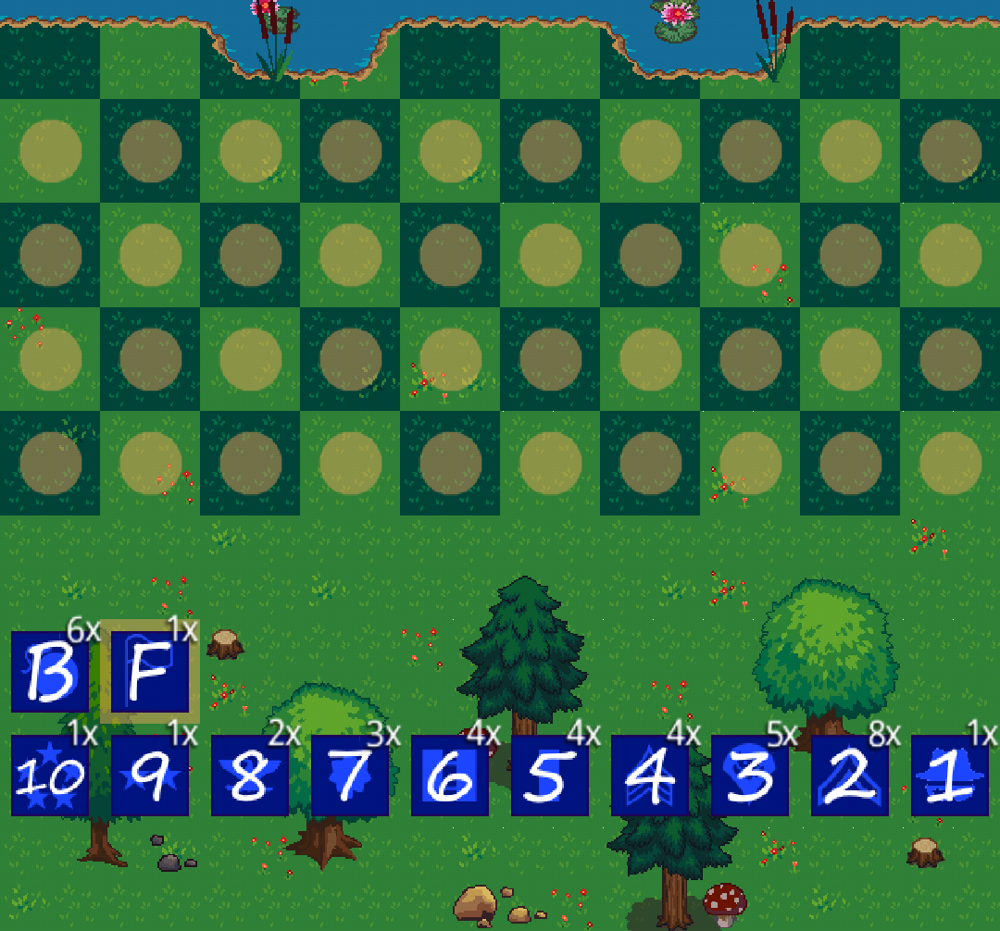
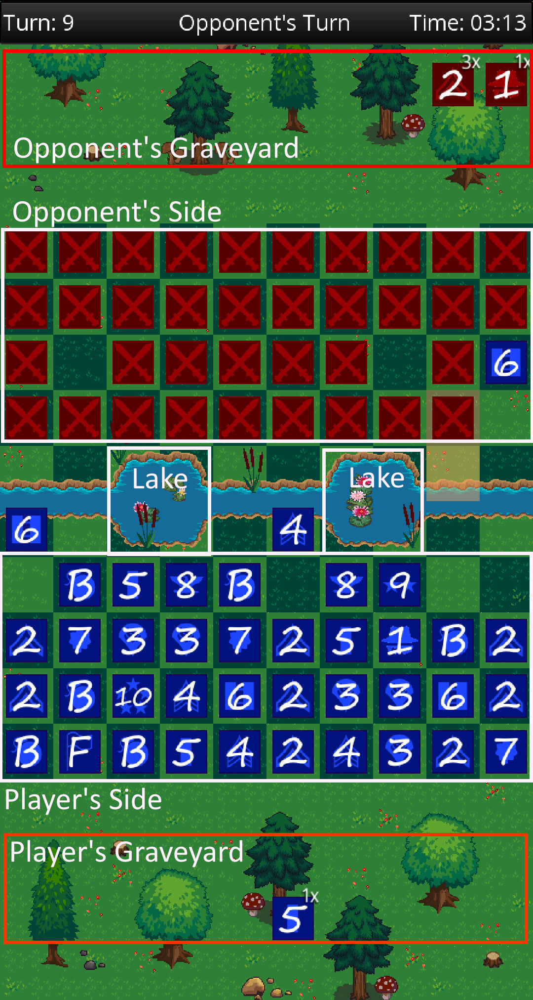
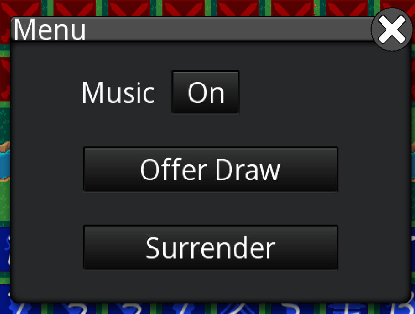

# Introduction

Stratego is a game in which you need to capture the flag of your opponent while defending your own flag. To capture the flag you use your army of 40 pieces. Pieces have a rank and represent individual officers and soldiers in an army. In addition to those ranked pieces you can use bombs to protect your flag.

# Setup

At the start of the game, each player arranges their 40 pieces in a 4x10 configuration at their side of the field. By tapping a piece followed by an orange highlight, a piece can be placed and moved on the playing field. A double tap removes the piece from the playing field and places it back at the start position. If all pieces are placed on the field, the player can confirm the final position by pressing the just appeared 'ready'-button. The game will start after both players placed all pieces on the board and confirmed the ready check.

# Gameplay 

Players alternate moving; the starting player is chosen at random. A player must move a piece in his turn. The board consists of 10x10 squares. Two Zones in the middle of the board, each 2x2, cannot be entered by either player's pieces at any time.
Pieces move 1 square per turn, horizontally or vertically. Only the scout can move over multiple empty squares per turn. Pieces cannot jump over another piece. No piece can move back and forth between the same two spaces for more than three consecutive turns (two square rule).If a piece is moved onto a square occupied by an opposing piece, their identities are revealed. The weaker piece is removed from the board, and the stronger piece is moved into the place formerly occupied by the weaker piece. If the engaging pieces are of equal rank, they are both removed. Pieces may not move onto a square already occupied by another piece without attacking. Exception to the rule of the higher rank winning is the spy. When the spy attacks the marshal, the spy defeats the higher ranked marshal. However, when the marshal attacks the spy, the spy loses. Bombs lose when they are defused by a miner.

A piece can only be moved during the player's turn by tapping on it. An orange highlights apprear to indicate the the allowed moves for the selected piece. Another tap on an highlight moves the piece. 

# Game Menu

In the game menu, which appears by clicking on the top bar, the game can be surrendered or a draw offer to other player can be made. 

# Ranks

## B - Bomb (6x) 
The Bomb is immovable. It defeats any attacking piece except the Miner.

## 10 - Marshal (1x) 

The Marshal is the highest ranked piece in the game. It can capture all other pieces except the bomb, but can be captured by the Spy, if the Spy attacks first.

## 9 - General (1x) 

The General can capture any lower ranked piece. 

## 8 - Colonel (2x) 
The Colonel can capture any lower ranked piece.

## 7 - Major (3x) 
The Major can capture any lower ranked piece.

## 6 - Captain (4x) 
The Captain can capture any lower ranked piece.

## 5 - Lieutenant (4x) 
The Lieutenant can capture any lower ranked piece.

## 4 - Sergeant (4x) 
The Sergeant can capture any lower ranked piece.

## 3 - Miner (5x) 
The Miner can defuse bombs and capture any lower ranked piece.

## 2 - Scout (8x) 
The Scout can move any distance in a straigt line without leaping over pieces or the lakes. It can capture the Spy.

## 1 - Spy (1x) 
The Spy can defeat the Marshal but only if the Spy makes the attack.

## F - Flag (1x)  
The Flag is immovable. It can be captured by any movable piece. Its capture ends the game.

